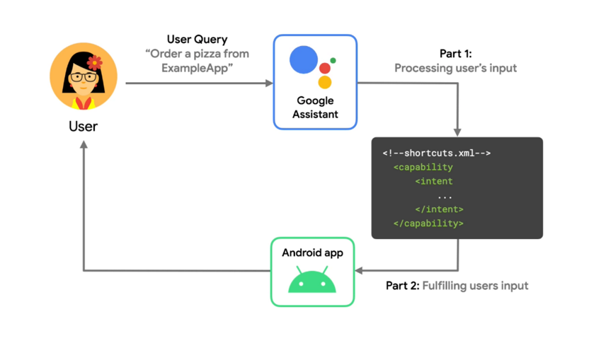
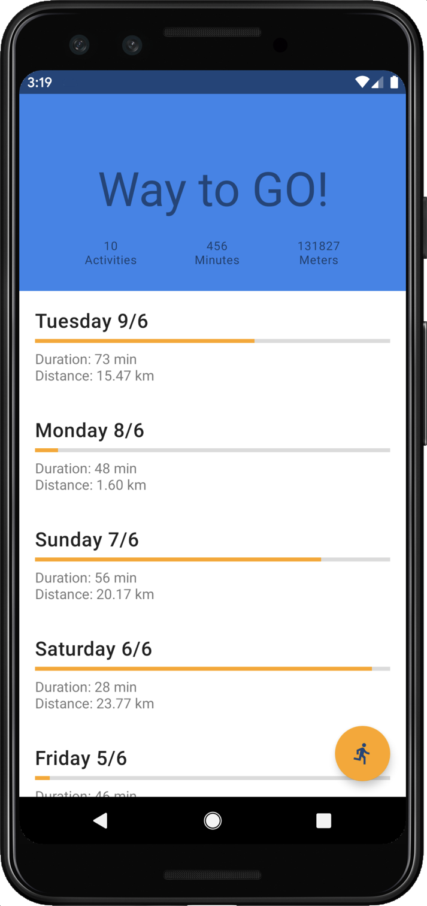

## 1\. 概览

借助与应用有关的 Action，您可以通过语音使用 Google 助理直接跳转到应用功能并完成任务。作为 Android 开发者，您可以实现功能元素来添加与应用有关的 Action。这些功能可让 Google 助理知道哪些应用功能支持用户语音请求，以及您希望以何种方式执行这些请求。

此 Codelab 介绍了与应用有关的 Action 的相关开发工作的初级概念。您最好拥有开发 Android 应用和 [Android intent](https://developer.android.com/guide/components/intents-filters?hl=zh-cn#Types) 的经验，以便顺利完成此 Codelab。如果您刚开始接触 Android，最好改为从某个 [Android 开发者基础知识](https://developer.android.com/courses/fundamentals-training/toc-v2?hl=zh-cn) Codelab 开始学习。

## 构建内容

在此 Codelab 中，您将向示例 Android 健身应用添加两个与应用有关的 Action 的内置 intent (BII)，以便用户通过语音启动和停止锻炼计时器。

## 学习内容

您将学习如何使用[健康与健身](https://developers.google.com/assistant/app/reference/built-in-intents/health-and-fitness?hl=zh-cn)类别中的 BII 将 Google 助理的功能扩展到 Android 应用。此外，您还将学习使用适用于 Android Studio 的 [Google 助理插件](https://developers.google.com/assistant/app/test-tool?hl=zh-cn)来测试 BII。

## 前提条件

在继续学习之前，请确保您的环境中已安装下列工具：

+   已安装 [git](https://git-scm.com/) 的终端，用于运行 shell 命令。
+   最新版 [Android Studio](https://developer.android.com/studio?hl=zh-cn)。
+   有权访问 \[Google Play 管理中心\]\[\] 的 Google 帐号。
+   一台可连接到互联网以访问 Play 商店的 Android 实体设备或虚拟设备。

在继续学习之前，请确保在测试设备上使用同一个 Google 帐号[登录 Android Studio](https://developer.android.com/studio/intro?hl=zh-cn#sign-in) 和 Google 应用。

## 2\. 了解运作方式

与应用有关的 Action 会将用户从 Google 助理关联到您的 Android 应用，那么其运作方式是怎样的？

当用户要求 Google 助理使用您的应用执行任务时，Google 助理会将用户的询问与您应用的 [`shortcuts.xml`](https://developers.google.com/assistant/app/action-schema?hl=zh-cn) XML 资源中定义的与应用有关的 Action 进行匹配。



**图 1.** 一张流程图，演示了 Google 助理如何处理与应用有关的 Action 的语音询问。

每个功能元素都会定义以下各项：

+   一个 intent：应触发相应功能的与应用有关的 Action 的语音 intent。
+   一个或多个执行方式：Google 助理生成的 Android intent 或深层链接，用于启动应用并执行用户语音请求。执行方式定义指定了预计会从用户询问中获取哪些参数，以及这些参数应如何编码为启动指令。

### intent

在自然语言理解 (NLU) 中，intent 是一组含义相似的用户短语。Google 已经创建了数十个“内置”intent (BII)，涵盖适用于与应用有关的 Action 的多种请求类型。例如，Google 助理经过训练，可以将短语“订一份披萨”或“显示甜点菜单”与 [`ORDER_MENU_ITEM`](https://developers.google.com/assistant/app/reference/built-in-intents/food-and-drink/order-menu-item?hl=zh-cn) BII 相关联。借助与应用有关的 Action，您可以利用这些 BII 将常见的语音请求快速扩展到应用功能。

### 执行方式

如果用户请求触发 `shortcuts.xml` 中与应用有关的 Action，则您的 Android activity 必须检测和处理传入的 Android intent 或深层链接，并向用户提供他们所需的功能。这将产生如下由语音驱动的用户体验：Google 助理调用您的应用来响应用户的询问。

## 3\. 准备开发环境

此 Codelab 使用的是适用于 Android 的示例健身应用。借助此应用，用户可以启动和停止锻炼计时器，还可以查看他们的日常锻炼安排的相关统计信息。

## **下载基础文件**

若要获取此 Codelab 的基础文件，请运行以下命令，克隆 [GitHub 代码库](https://github.com/actions-on-google/appactions-fitness-kotlin)：

git clone --branch codelab-start https://github.com/actions-on-google/appactions-fitness-kotlin.git

克隆完代码库后，在 Android Studio 中将其打开：

1.  在 **Welcome to Android Studio** 对话框中，点击 **Import project**。
2.  查找并选择您克隆代码库的文件夹。

## **更新 Android 应用 ID**

更新应用的应用 ID 可唯一标识测试设备上的应用，同时避免在向 Play 管理中心上传应用时出现“Duplicate package name”错误。若要更新应用 ID，请打开 `app/build.gradle`：

```auto
android {
...
  defaultConfig {
    applicationId "com.MYUNIQUENAME.android.fitactions"
    ...
  }
}
```

将 `applicationId` 字段中的“MYUNIQUENAME”替换为您独有的名称。

## 在您的设备上试用应用

在对应用代码做出进一步更改之前，最好先了解一下示例应用的功能。在开发环境中测试应用涉及以下步骤：

1.  打开您的 Android 虚拟测试设备或实体测试设备。
2.  验证 Google 助理应用能否正常运行。
3.  使用 Android Studio 在您的设备上部署和运行示例应用。

请按照以下步骤测试应用：

1.  在 Android Studio 中，依次选择 **Run** > **Run app**，或点击工具栏中的 **Run** 图标 。
2.  如果使用的是虚拟设备，请在 **Select Deployment Target** 对话框中，选择虚拟设备，然后点击 **OK**。虽然 Action 在搭载 Android 5（API 级别 21）的设备上能够运行，但我们推荐使用的操作系统版本为 Android 8（API 级别 26）或更高版本。
3.  打开应用后，长按主屏幕按钮，以设置 Google 助理并验证其能否正常运行。如果您尚未登录 Google 助理，请先登录。
4.  重新打开应用。



**图 2.** 显示锻炼统计信息的 Fit Actions 示例应用。

快速浏览应用以了解其功能。点按“Run”图标可启动锻炼计时器，而点按“X”图标则可停止计时器。这些是您将通过与应用有关的 Action 启用语音控制的任务。

## 安装 Google 助理插件

借助 [Google 助理插件](https://developers.google.com/assistant/app/test-tool?hl=zh-cn)，您可以在测试设备上测试与应用有关的 Action。请按照以下步骤将其添加到 Android Studio：

1.  依次前往 **File** > **Settings**（在 MacOS 上，依次前往 **Android Studio** > **Preferences**）。
2.  在“Plugins”部分中，前往 Marketplace 并搜索“Google Assistant”。
3.  安装该工具，然后重启 Android Studio。

## 4\. 添加 Start Exercise BII 功能

借助 [`actions.intent.START_EXERCISE`](https://developers.google.com/assistant/app/reference/built-in-intents/health-and-fitness/start-exercise?hl=zh-cn) BII，用户可以通过语音打开应用并开始锻炼。在此步骤中，您将实现此 BII 的功能，让用户能够向 Google 助理发出使用健身应用开始跑步的指令。

## 定义功能

Google 助理会使用 `shortcuts.xml` 中定义的 `capability` 元素，按照以下步骤处理语音指令语音：

1.  Google 助理将用户语音询问与您应用的功能中定义的 BII 进行匹配。
2.  Google 助理将询问中的值提取到 BII 参数中。每个参数都会添加到 `Bundle`（已附加到生成的 `Intent`）中。
3.  Google 助理使用 `Intent` 启动应用，让应用可以访问捆绑的参数。

[`START_EXERCISE`](https://developers.google.com/assistant/app/reference/built-in-intents/health-and-fitness/start-exercise?hl=zh-cn) BII 支持 `exercise.name` BII 参数。您将使用此参数来允许用户在应用中指定要跟踪的锻炼类型。

将 [`START_EXERCISE`](https://developers.google.com/assistant/app/reference/built-in-intents/health-and-fitness/start-exercise?hl=zh-cn) BII 添加到您的应用，只需将此 `capability` 添加到 `shortcuts.xml`（位于 `app/src/main/res/xml` 示例项目目录中）即可：

```auto
<!-- shortcuts.xml -->

<capability android:name="actions.intent.START_EXERCISE">
  <intent
    android:action="android.intent.action.VIEW"
    android:targetPackage="PUT_YOUR_APPLICATION_ID_HERE"
    android:targetClass="com.devrel.android.fitactions.FitMainActivity">
    <parameter
      android:name="exercise.name"
      android:key="exerciseType"/>
  </intent>
</capability>
```

将 `PUT_YOUR_APPLICATION_ID_HERE` 替换为您在上一步中定义的唯一 `applicationId`。

上面的示例 XML 会：

+   声明 `START_EXERCISE` BII 的功能。
+   指定 Google 助理生成的 Android `intent`（用于启动应用）：
    +   `targetPackage` 和 `targetClass` 属性指定接收 activity。
    +   `parameter` 属性将 `exercise.name` BII 参数映射到该 activity 接收的 `Bundle` extra 中的 `exerciseType`。

## 使用内嵌目录处理 BII 参数

BII 参数表示从 Google 助理用户询问中提取的元素。例如，当用户说出“Hey Google，在 ExampleApp 中开始跑步”时，Google 助理会将“跑步”提取到 `exercise.name` [schema.org](https://schema.org/) BII 参数中。对于某些 BII，您可以指示 Google 助理将 BII 参数与您应用所需的一组标识符进行匹配。

为此，您需要将[内嵌目录](https://developers.google.com/assistant/app/inline-inventory?hl=zh-cn)元素绑定到 BII 参数。内嵌目录是一组支持的 BII 参数值（例如“跑步”“远足”和“慢跑”）及其对应的快捷方式 ID（例如 `EXERCISE_RUN`）。通过这种目录绑定，Google 助理可以将用于匹配参数的快捷方式 ID（而不是原始询问值）传递给执行方式 activity。

某些 BII 参数（例如 `exercise.name`）需要使用内嵌目录才能正常运行。若要处理此参数，请将以下目录 `shortcut` 元素添加到 `shortcuts.xml`：

```auto
<!-- shortcuts.xml -->

<shortcuts>
  <shortcut
    android:shortcutId="running"
    android:shortcutShortLabel="@string/activity_running">
    <capability-binding android:key="actions.intent.START_EXERCISE">
      <parameter-binding
        android:key="exercise.name"
        android:value="@array/runningSynonyms"/>
    </capability-binding>
  </shortcut>

  <shortcut
    android:shortcutId="walking"
    android:shortcutShortLabel="@string/activity_walking">
    <capability-binding android:key="actions.intent.START_EXERCISE">
      <parameter-binding
        android:key="exercise.name"
        android:value="@array/walkingSynonyms"/>
    </capability-binding>
  </shortcut>

  <shortcut
    android:shortcutId="cycling"
    android:shortcutShortLabel="@string/activity_cycling">
    <capability-binding android:key="actions.intent.START_EXERCISE">
      <parameter-binding
        android:key="exercise.name"
        android:value="@array/cyclingSynonyms"/>
    </capability-binding>
  </shortcut>

  <capability> ... </capability>
</shortcuts>
```

在前面的代码中，您定义了三个快捷方式，用于表示应用支持的锻炼类型的内嵌目录：跑步、步行和骑车。每个快捷方式都可通过以下方式绑定到该功能：

+   每个 `capability-binding` 元素的 `android:key` 属性都引用了为该功能定义的相同 `START_EXCERCISE`。
+   每个快捷方式的 `parameter-binding` 元素都与 `exercise.name` BII 参数相对应。

## 添加内嵌目录同义词

上述目录快捷方式中 `parameter-binding` 元素的 `android:value` 属性引用了每个目录元素的同义词数组资源。同义词使元素类型的变体（例如“跑步”“慢跑”和“短跑”）能够引用相同的 `shortcutId`。请将以下同义词条目添加到项目的 `array.xml` 资源中：

```auto
<!-- array.xml -->
<array name="runningSynonyms">
  <item>Run</item>
  <item>Jog</item>
  <item>Jogging</item>
  <item>Sprint</item>
</array>

<array name="walkingSynonyms">
  <item>Walk</item>
  <item>Hike</item>
  <item>Hiking</item>
</array>

<array name="cyclingSynonyms">
  <item>Biking</item>
  <item>Riding</item>
  <item>Pedaling</item>
</array>
```

## 执行传入的 Android intent

Android intent 是 Android 用来从其他应用请求操作的消息传递对象。Google 助理根据所触发功能中的配置详细信息生成 intent，从而执行用户的语音询问。为了执行 [`START_EXERCISE`](https://developers.google.com/assistant/app/reference/built-in-intents/health-and-fitness/start-exercise?hl=zh-cn) 功能的 intent，请更新 `FitMainActivity` 目标类来处理传入的 intent 和 BII 参数。

首先，使用以下代码替换 `Intent.handleIntent` 函数：

```kotlin
//FitMainActivity.kt

private fun Intent.handleIntent() {
  when (action) {
    // When the BII is matched, Intent.Action_VIEW will be used
    Intent.ACTION_VIEW -> handleIntent(data)
    // Otherwise start the app as you would normally do.
    else -> showDefaultView()
  }
}

```

接下来，使用以下代码将新的 `handleIntent` 函数添加到类中：

```kotlin
//FitMainActivity.kt

/**
 * Use extras provided by the intent to handle the different BIIs
 */

private fun handleIntent(data: Uri?) {
  // path is normally used to indicate which view should be displayed
  // i.e https://fit-actions.firebaseapp.com/start?exerciseType="Running" -> path = "start"
  var actionHandled = true

  val startExercise = intent?.extras?.getString(START_EXERCISE)
  // Add stopExercise variable here

  if (startExercise != null){
    val type = FitActivity.Type.find(startExercise)
    val arguments = Bundle().apply {
      putSerializable(FitTrackingFragment.PARAM_TYPE, type)
    }
    updateView(FitTrackingFragment::class.java, arguments)
  } // Add conditional for stopExercise
  else{
   // path is not supported or invalid, start normal flow.
   showDefaultView()

   // Unknown or invalid action
   actionHandled = false
  }
  notifyActionSuccess(actionHandled)
}
```

在前面的 `Intent.handleIntent` 函数中，当 `ACTION_VIEW` 触发时，与应用有关的 Action intent 数据会传递给 `handleIntent` 函数。[`START_EXERCISE`](https://developers.google.com/assistant/app/reference/built-in-intents/health-and-fitness/start-exercise?hl=zh-cn) intent 中捆绑的 BII 参数通过 `intent?.extras?.getString(START_EXERCISE)` 进行访问。该函数的其余部分会更新 `FitTrackingFragment`，以显示所选的 `startExercise` 健身类型。

## 测试与应用有关的 Action

在与应用有关的 Action 开发期间，您可以使用 [Google 助理插件](https://developers.google.com/assistant/app/test-tool?hl=zh-cn)在测试设备上预览 Action。此外，您还可以使用该插件调整 Action 的 intent 参数值，以便测试您的应用如何处理用户针对您的应用向 Google 助理发出请求时可能采用的各种方式。

若要使用该插件测试与应用有关的 Action，请按以下步骤操作：

1.  在 Android Studio 中运行您的应用，具体方法是依次选择 **Run** > **Run App**，或点击顶部工具栏中的 **Run** 图标。
2.  依次前往 **Tools** > **App Actions** > **Google Assistant** > **App Actions Test Tool**。
3.  点击 **Create Preview**。如果出现提示，请查看并接受与应用有关的 Action 方面的政策和服务条款。
4.  选择 `actions.intent.START_EXERCISE` 内置 intent。
5.  在 **exercise** 框中，保留默认的 **running** 值。
6.  点击 **Run App Action**。验证 Google 助理是否深层链接到应用的锻炼计时器，以及计时器是否已开始跑步类型的锻炼。

您已经使用 [`START_EXERCISE`](https://developers.google.com/assistant/app/reference/built-in-intents/health-and-fitness/start-exercise?hl=zh-cn) BII 实现了首个与应用有关的 Action。恭喜！接下来，我们将让用户能够在您的应用中停止跑步锻炼。

## 5\. 添加 Stop Exercise BII 功能

借助 [`actions.intent.STOP_EXERCISE`](https://developers.google.com/assistant/app/reference/built-in-intents/health-and-fitness/stop-exercise?hl=zh-cn) BII，用户可以说出“Hey Google，在 ExampleApp 中停止跑步”这样的语音指令来停止锻炼会话。您可以通过向 `shortcuts.xml` 添加第二个 `capability`，在健身应用中实现此 BII：

```auto
<!-- shortcuts.xml -->

<capability android:name="actions.intent.STOP_EXERCISE">
  <intent
    android:action="android.intent.action.VIEW"
    android:targetPackage="PUT_YOUR_APPLICATION_ID_HERE"
    android:targetClass="com.devrel.android.fitactions.FitMainActivity">
    <!-- Eg. name = "Running" -->
    <parameter
        android:name="exercise.name"
        android:key="stopExercise"/>
  </intent>
</capability>
```

将 `PUT_YOUR_APPLICATION_ID_HERE` 替换为您的唯一 `applicationId`。

## 使用内嵌目录处理 BII 参数

此 BII 支持的 `exercise.name` 参数与 [`START_EXERCISE`](https://developers.google.com/assistant/app/reference/built-in-intents/health-and-fitness/start-exercise?hl=zh-cn) BII 相同，让用户可以指定他们想要结束哪些正在进行的锻炼。若要启用此功能，请向 `shortcuts.xml` 再添加一组目录快捷方式元素：

```auto
<!-- shortcuts.xml -->

<shortcut
  android:shortcutId="running"
  android:shortcutShortLabel="@string/activity_running">
  <capability-binding android:key="actions.intent.STOP_EXERCISE">
      <parameter-binding
          android:key="exercise.name"
          android:value="@array/runningSynonyms"/>
  </capability-binding>
</shortcut>

<shortcut
  android:shortcutId="walking"
  android:shortcutShortLabel="@string/activity_walking">
  <capability-binding android:key="actions.intent.STOP_EXERCISE">
      <parameter-binding
          android:key="exercise.name"
          android:value="@array/walkingSynonyms"/>
  </capability-binding>
</shortcut>

<shortcut
  android:shortcutId="cycling"
  android:shortcutShortLabel="@string/activity_cycling">
  <capability-binding android:key="actions.intent.STOP_EXERCISE">
      <parameter-binding
          android:key="exercise.name"
          android:value="@array/cyclingSynonyms"/>
  </capability-binding>
</shortcut>
```

## 执行传入的 Android intent

您可以更新 `FitMainActivity` 类，让应用能够处理传入的 [`STOP_EXERCISE`](https://developers.google.com/assistant/app/reference/built-in-intents/health-and-fitness/stop-exercise?hl=zh-cn) Android intent。首先，将变量添加到 `handleIntent` 函数，以保存 [`STOP_EXERCISE`](https://developers.google.com/assistant/app/reference/built-in-intents/health-and-fitness/stop-exercise?hl=zh-cn) intent 数据：

```auto
// FitMainActivity.kt

private fun handleIntent(data: Uri?) {
  val stopExercise = intent?.extras?.getString(STOP_EXERCISE)
  //...
}
```

接下来，更新 `handleIntent` 函数的条件逻辑，以处理 [`STOP_EXERCISE`](https://developers.google.com/assistant/app/reference/built-in-intents/health-and-fitness/stop-exercise?hl=zh-cn) intent：

```auto
// FitMainActivity.kt

private fun handleIntent(data: Uri?) {
  //...
  if (startExercise != null){
    val type = FitActivity.Type.find(startExercise)
    val arguments = Bundle().apply {
      putSerializable(FitTrackingFragment.PARAM_TYPE, type)
    }
    updateView(FitTrackingFragment::class.java, arguments)
  } // Add conditional for stopExercise
  <strong>
  } else if(stopExercise != null){
    // Stop the tracking service if any and return to home screen.
    stopService(Intent(this, FitTrackingService::class.java))
    updateView(FitStatsFragment::class.java)
  }
  </strong>
  //...
}
```

在前面的代码中，您更新了 `handleIntent` 函数，以检查传入的 Android intent 中是否存在 [`STOP_EXERCISE`](https://developers.google.com/assistant/app/reference/built-in-intents/health-and-fitness/stop-exercise?hl=zh-cn) BII。如果存在，该函数会停止正在运行的计时器，并让用户返回到主屏幕。

## 测试与应用有关的 Action

请按照以下步骤，使用 Google 助理插件测试与应用有关的 Action：

1.  在 Android Studio 中运行您的应用，具体方法是依次选择 **Run** > **Run App**，或点击顶部工具栏中的 **Run** 图标。
2.  在该应用中，开始新的“跑步”锻炼。
3.  在 Android Studio 中打开该插件：依次前往 **Tools** > **App Actions** > **Google Assistant** > **App Actions Test Tool**。
4.  点击 **Create Preview**。
5.  选择 `actions.intent.STOP_EXERCISE` 内置 intent。
6.  在 **exercise** 框中，保留默认的 **running** 值。
7.  点击 **Run App Action**。验证 Google 助理是否会停止锻炼并让您返回到主屏幕。

## 6\. 结尾

**恭喜！**

现在，您了解了如何使用 Google 助理内置 intent 为 Android 应用启用语音功能。在此 Codelab 中，您学习了以下内容：

+   如何利用 Google 助理让用户深入体验特定的应用功能。
+   如何使用内嵌目录。
+   如何使用 [Google 助理插件](https://developers.google.com/assistant/app/test-tool?hl=zh-cn)测试 BII。

